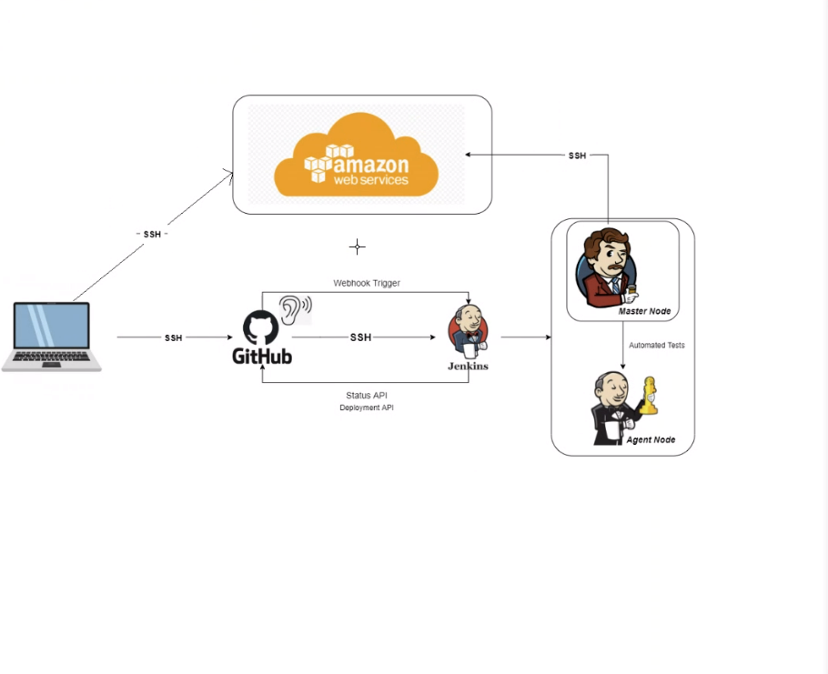
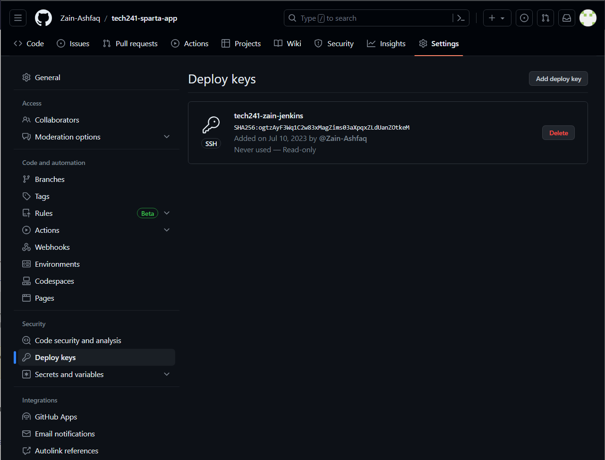

# DevOps Culture and CICD

## Introduction

- DevOps is a software development methodology that combines software development (Dev) with IT operations (Ops) participating together in the entire service lifecycle.
- DevOps is a culture that bridges the gap between development and operation teams.
- Docker and Jenkins are some of the high demand DevOps practices and tools.

## Docker

- Docker is a virtualization platform to containerize your app.
- Docker enables you to build a container image and use that same image across every step of the deployment process.
- Docker makes it easier to create, deploy, and run applications by using containers.

## Continuous Integration and Continuous Delivery (CI/CD)

- CI/CD is considered as the backbone of DevOps practices and automation.
- Continuous Integration (CI): Developers merge/commit code to master branch multiple times a day, fully automated build and test process which gives feedback within few minutes.
- Continuous Delivery: An extension of continuous integration to make sure that you can release new changes to your customers quickly in a sustainable way. The deployment is completed manually.
- Continuous Deployment: Every change that passes all stages of your production pipeline is released to your customers, there is no human intervention, and only a failed test will prevent a new change to be deployed to production.

## CI/CD Workflow

- The CI/CD pipeline is all about automation: Initiating code builds, automated testing, and automated deploying to the staging or production environments.

## Jenkins

- Jenkins is an open-source automation server in which the central build and CI process take place.
- Jenkins supports building, deploying, and automating for software development projects.

## Other tools that can be used for CICD

- GitLab CI/CD: GitLab offers an integrated CICD platform that combines version control, issue tracking, and CICD pipelines in a single application.

## Why build a pipeline?

Building a pipeline for CICD brings several benefits:

- Automation: A pipeline automates the build, test, and deployment processes, reducing manual effort and human error.
- Consistency: With a pipeline, you ensure that every change to the codebase goes through the same set of tests and quality checks.
- Efficiency: A well-optimized pipeline can significantly speed up the development and release cycles.
- Collaboration: CICD pipelines encourage collaboration among team members by providing a centralized and transparent process.

## Business value

Implementing CICD pipelines can bring several business advantages:

- Faster time-to-market: Continuous delivery enables quicker release cycles, allowing businesses to respond to customer demands and market changes more rapidly.
- Higher quality: Automated testing and deployment processes ensure consistent quality and reduce the likelihood of introducing bugs or errors.
- Scalability: CICD pipelines enable scalability by providing a streamlined and repeatable process for deploying applications to various environments.
- Risk reduction: Continuous integration catches integration issues early on, reducing the risk of critical failures in production.

## Summary

- Increase the frequency and pace of releases so you can innovate and improve your product faster.
- Continuous integration and continuous delivery/deployment are practices that automate the software release process, from build to deploy in DevOps culture.

## Creating SSH Key Pair and Adding Public Key to GitHub

Use the command `ssh-keygen -t rsa -b 4096 -C "youremail@.com" -f tech241-zain-jenkins` to generate the SSH key pair.

# Steps to Add SSH Key to GitHub:

1. Log in to your GitHub account.
2. Navigate to the "app" repository and then to settings by clicking on your profile picture.
3. In the left sidebar, click on "Deploy keys".
4. Click on "New SSH key".
5. Give the key a title (e.g., "Jenkins SSH key").
6. Copy the contents of the public key file and paste it into the "Key" field.
7. Click on "Add SSH key" to save it.
   
