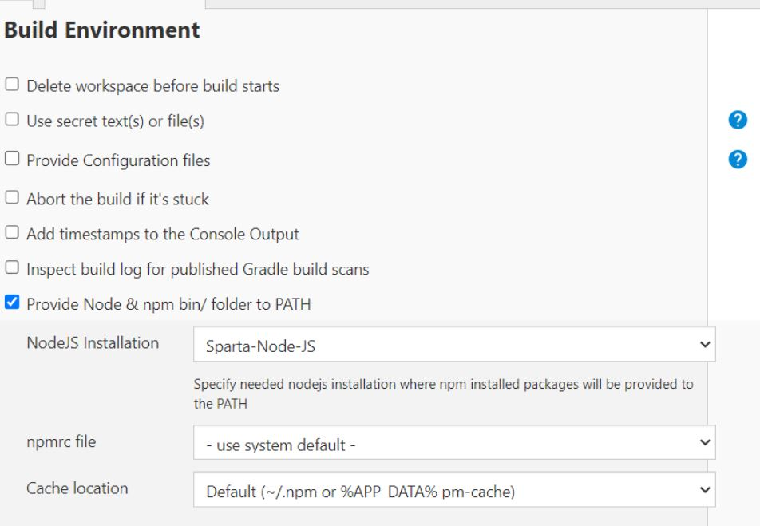

# DevOps Culture and CICD

## Introduction

- DevOps is a software development methodology that combines software development (Dev) with IT operations (Ops) participating together in the entire service lifecycle.
- DevOps is a culture that bridges the gap between development and operation teams.
- Docker and Jenkins are some of the high demand DevOps practices and tools.

## Docker

- Docker is a virtualization platform to containerize your app.
- Docker enables you to build a container image and use that same image across every step of the deployment process.
- Docker makes it easier to create, deploy, and run applications by using containers.

## Continuous Integration and Continuous Delivery (CI/CD)

- CI/CD is considered as the backbone of DevOps practices and automation.
- Continuous Integration (CI): Developers merge/commit code to master branch multiple times a day, fully automated build and test process which gives feedback within few minutes.
- Continuous Delivery: An extension of continuous integration to make sure that you can release new changes to your customers quickly in a sustainable way. The deployment is completed manually.
- Continuous Deployment: Every change that passes all stages of your production pipeline is released to your customers, there is no human intervention, and only a failed test will prevent a new change to be deployed to production.

## CI/CD Workflow

- The CI/CD pipeline is all about automation: Initiating code builds, automated testing, and automated deploying to the staging or production environments.

## Jenkins

- Jenkins is an open-source automation server in which the central build and CI process take place.
- Jenkins supports building, deploying, and automating for software development projects.

## Other tools that can be used for CICD

- GitLab CI/CD: GitLab offers an integrated CICD platform that combines version control, issue tracking, and CICD pipelines in a single application.

## Why build a pipeline?

Building a pipeline for CICD brings several benefits:

- Automation: A pipeline automates the build, test, and deployment processes, reducing manual effort and human error.
- Consistency: With a pipeline, you ensure that every change to the codebase goes through the same set of tests and quality checks.
- Efficiency: A well-optimized pipeline can significantly speed up the development and release cycles.
- Collaboration: CICD pipelines encourage collaboration among team members by providing a centralized and transparent process.

## Business value

Implementing CICD pipelines can bring several business advantages:

- Faster time-to-market: Continuous delivery enables quicker release cycles, allowing businesses to respond to customer demands and market changes more rapidly.
- Higher quality: Automated testing and deployment processes ensure consistent quality and reduce the likelihood of introducing bugs or errors.
- Scalability: CICD pipelines enable scalability by providing a streamlined and repeatable process for deploying applications to various environments.
- Risk reduction: Continuous integration catches integration issues early on, reducing the risk of critical failures in production.

## Summary

- Increase the frequency and pace of releases so you can innovate and improve your product faster.
- Continuous integration and continuous delivery/deployment are practices that automate the software release process, from build to deploy in DevOps culture.

## Creating SSH Key Pair and Adding Public Key to GitHub

Use the command `ssh-keygen -t rsa -b 4096 -C "youremail@.com" -f tech241-zain-jenkins` to generate the SSH key pair.

# Steps to Add SSH Key to GitHub:

1. Log in to your GitHub account.
2. Navigate to the "app" repository and then to settings by clicking on your profile picture.
3. In the left sidebar, click on "Deploy keys".
4. Click on "New SSH key".
5. Give the key a title (e.g., "Jenkins SSH key").
6. Copy the contents of the public key file and paste it into the "Key" field.
7. Click on "Add SSH key" to save it.
   

# Integration between Jenkins and Github

## Setting up Jenkins

**Step 1:** Copy the HTTPS URL from your Github repository and add it to the project URL field.

**Step 2:** In the Source Code Management section, select 'GIT' and copy the SSH URL from your Github repository.

**Step 3:** Add credentials by copying the private key (the pair of the public key from the app repo with the same name and exact content).

**Step 4:** Change the branch name to `main`.

**Step 5:** In the Build Environment section, select `Provide Node & npm bin/folder to PATH` and choose `SParta-Node-JS` so it can test our app.

**Step 6:** In the Office 365 Connector, restrict where the node agent will test the app to separate it from the Node master.

**Step 7:** Add your testing commands.

**Step 8:** Save the job. You are now ready to build and test.

## Creating a webhook on GitHub with Jenkins

### Configuring GitHub

**Step 1:** Go to your GitHub repository and click on `Settings`.

**Step 2:** Click on `Webhooks` and then click on `Add webhook`.

**Step 3:** In the `Payload URL` field, paste your Jenkins environment URL. At the end of this URL add `/github-webhook/`. In the `Content type` select: `application/json` and leave the `Secret` field empty.

**Step 4:** In the page `Which events would you like to trigger this webhook?` choose `Let me select individual events.` Then, check `Pull Requests` and `Pushes`. At the end of this option, make sure that the `Active` option is checked and click on `Add webhook`.

### Configuring Jenkins

**Step 5:** In Jenkins, click on `New Item` to create a new project.

**Step 6:** Click on the `Build Triggers` tab and then on the `GitHub hook trigger for GITScm polling`. Or, choose the trigger of your choice.

After all of those steps, Jenkins will run the job every time we will push or pull changes from the app repo.

# Install Jenkins on brand new EC2 commands

1. `sudo apt update -y`
   - Updates the local package index on the system using the Advanced Package Tool (APT).
2. `sudo wget -q -O - https://pkg.jenkins.io/debian/jenkins.io.key | sudo apt-key add -`
   - Downloads the Jenkins repository key from the specified URL and adds it to the system's list of trusted keys.
3. `sudo sh -c 'echo deb http://pkg.jenkins.io/debian-stable binary/ > /etc/apt/sources.list.d/jenkins.list'`
   - Adds the Jenkins repository URL to the APT sources list, allowing the system to fetch Jenkins packages from the repository.
4. `sudo apt update`
   - Updates the package index again to include the Jenkins repository after adding it in the previous step.
5. `sudo apt install jenkins`
   - Installs Jenkins on the system by fetching and installing the Jenkins package from the repository.
6. `wget -q -O - https://pkg.jenkins.io/debian/jenkins.io.key | sudo apt-key add -`
   - Downloads the Jenkins repository key again and adds it to the trusted keys list.
7. `sudo apt update`
   - Updates the package index to include the Jenkins repository after adding the key in the previous step.
8. `sudo apt install jenkins`
   - Installs Jenkins on the system by fetching and installing the Jenkins package from the repository.
9. `sudo apt upgrade -y`
   - Upgrades all installed packages on the system to their latest versions.
10. `wget -q -O - https://pkg.jenkins.io/debian-stable/jenkins.io.key | sudo apt-key add -`
    - Downloads the Jenkins repository key for the stable version and adds it to the trusted keys list.
11. `sudo sh -c 'echo deb http://pkg.jenkins.io/debian-stable binary/ > /etc/apt/sources.list.d/jenkins.list'`
    - Adds the Jenkins stable version repository URL to the APT sources list.
12. `java -version`
    - Displays the version information for Java installed on the system.
13. `sudo apt install openjdk-11-jdk -y`
    - Installs OpenJDK 11 on the system, which is a required dependency for Jenkins.
14. `sudo apt update`
    - Updates the package index to include the Jenkins repository after adding it in the previous step.
15. `sudo apt install jenkins -y`
    - Installs Jenkins on the system by fetching and installing the Jenkins package from the repository.
16. `sudo apt-key adv --keyserver keyserver.ubuntu.com --recv-keys 5BA31D57EF5975CA`
    - Retrieves the GPG key from the Ubuntu key server using the specified key ID.
17. `sudo apt update`
    - Updates the package index to include the Jenkins repository after adding the key in the previous step.
18. `sudo apt install jenkins -y`
    - Installs Jenkins on the system by fetching and installing the Jenkins package from the repository.
19. `jenkins --version`
    - Displays the version information for Jenkins installed on the system.
20. `sudo systemctl enable jenkins`
    - Enables Jenkins as a system service, allowing it to start automatically on system boot.
21. `sudo systemctl start jenkins`
    - Starts the Jenkins service immediately.
22. `sudo systemctl status jenkins`
    - Retrieves the status of the Jenkins service, providing information about its current state.
23. `sudo cat /var/lib/jenkins/secrets/initialAdminPassword`

    - Displays the content of the initialAdminPassword file, which contains the administrator password for Jenkins.

# Setting up Jenkins

1. **Install Jenkins:**

   This step is essential to set up the Jenkins automation server, which will be responsible for executing the CI/CD pipeline and managing the jobs.

2. **Configure Git Host Key Verification:**

   Configuring Git Host Key Verification allows Jenkins to connect to Git repositories even if the SSL certificate is not trusted. This is particularly useful when connecting to repositories for the first time.

3. **Install Required Plugins:**

   - The SSH Plugin is crucial for performing remote operations over SSH. It allows Jenkins to interact with remote servers, deploy code, execute commands, and manage the deployment process securely.
   - The NodeJS Plugin is necessary to integrate Node.js functionality into Jenkins jobs. It enables running JavaScript code, executing npm commands, and leveraging the Node.js ecosystem in the build process.
   - You also need to make it available in the tools section

-

4. **Create the "Zain-CI" Job:**

   The "Zain-CI" job is the first step in the CI/CD pipeline. It performs tasks such as compiling code, running tests, and generating build artifacts. It ensures that code changes are validated and meet quality standards before further processing.
   
   
   
   

5. **Create the "Zain-CI-merge" Job:**

   The "Zain-CI-merge" job is responsible for merging the changes from the dev branch into the main branch or any other target branch. It ensures that code changes from different developers are integrated and tested together before deployment.
   
   
   
   
   
   

6. **Create the "Zain-deploy" Job:**

   The "Zain-deploy" job handles the deployment process. It typically involves packaging the application, deploying it to the target environment (e.g., staging or production), and configuring any necessary settings. This job ensures that the application is deployed correctly and ready for use.
   
   
   
   
   

7. **Configure Jenkins using Pre-configured Plugin:**

   Choosing the "Use pre-configured plugin" option during Jenkins setup allows for a quick and simplified initial configuration. It ensures that the necessary plugins, including the NodeJS Plugin and SSH Plugin, are installed and configured as part of the predefined plugin set.

8. **Set Up Job Dependencies:**

   Setting up job dependencies allows for the automatic triggering of subsequent jobs based on the completion of previous jobs. In this case, the "Zain-CI-merge" job will start only when the "Zain-CI" job completes successfully.

9. **Finalize Job Dependencies:**

   Similar to step 8, configuring job dependencies ensures that the "Zain-deploy" job waits for the successful completion of the "Zain-CI-merge" job before starting. This ensures that the application being deployed is based on the latest merged code.

10. **Test the Job Sequence:**

    Testing the job sequence ensures that the entire CI/CD pipeline works as expected. By committing and pushing changes, the "Zain-CI" job will trigger automatically, followed by the "Zain-CI-merge" job, and finally the "Zain-deploy" job. Monitoring the progress and reviewing the console output helps identify and resolve any errors or issues.
